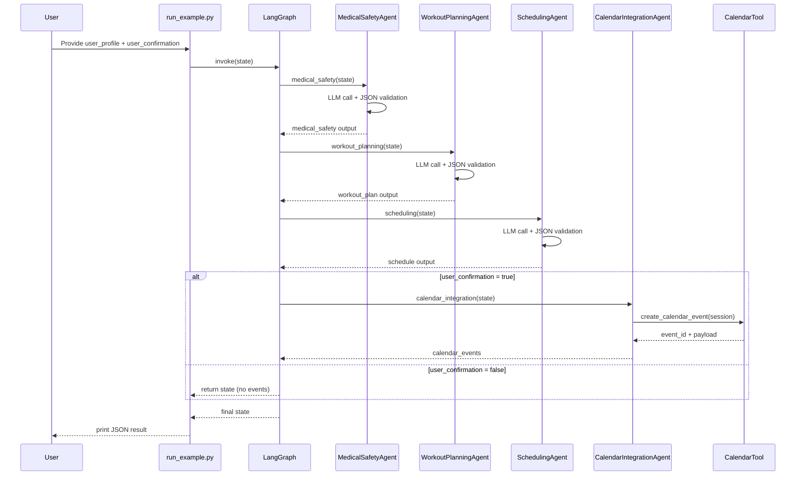

# Multi-Agent Personal Trainer System (LangGraph)

Production-grade, modular multi-agent AI pipeline that generates a personalized workout plan and optionally schedules it on a calendar. The system uses LangGraph for orchestration and OpenAI models for structured JSON outputs.

## What This Project Does
- Analyzes medical history to identify exercise constraints
- Builds a realistic workout plan aligned with goals
- Schedules sessions within availability
- Optionally creates calendar events after explicit user confirmation

## Architecture Overview
Agents (each returns strict JSON):
1. Medical Safety Agent
2. Workout Planning Agent
3. Scheduling Agent
4. Calendar Integration Agent (tool-backed)

Flow:
- `medical_safety` -> `workout_planning` -> `scheduling` -> `calendar_integration` (conditional)

## Sequence Diagram


## File Guide
- `pipeline.py`
  - Main LangGraph pipeline and agent implementations
  - Deterministic LLM calls and JSON validation with retries
  - Conditional routing to calendar integration

- `schemas.py`
  - Pydantic models for inputs and agent outputs
  - Shared LangGraph state schema

- `prompts.py`
  - System prompt templates for each agent

- `tools.py`
  - Calendar tool stub (replace with real Google Calendar API integration)

- `run_example.py`
  - Example run with mock inputs

- `requirements.txt`
  - Minimal runtime dependencies

## How To Run
1. Install dependencies
```bash
pip install -r requirements.txt
```

2. Set the OpenAI key
```bash
export OPENAI_API_KEY=your_key_here
```

3. Run the example
```bash
python run_example.py
```

## Notes On Safety And Validation
- Strict JSON is enforced with `JsonOutputParser` + Pydantic validation
- Invalid model outputs trigger retries with corrective instructions
- Calendar events are created only if `user_confirmation=True`

## Extending To Production
- Replace `tools.py` with Google Calendar API + OAuth
- Add storage for user profiles and plan history
- Add tests for schedule constraints and agent output validation

## License
Internal / private use
